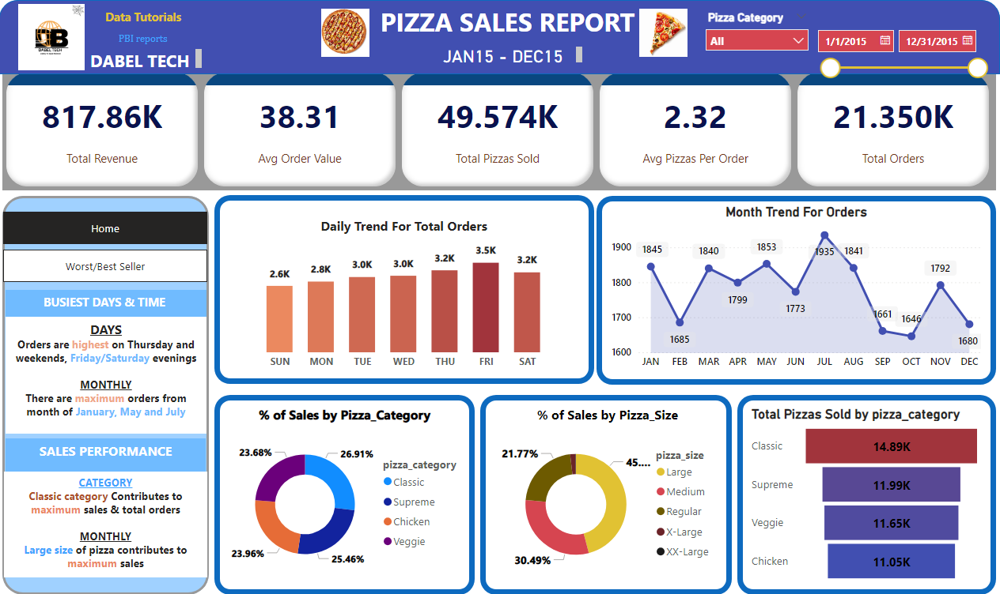
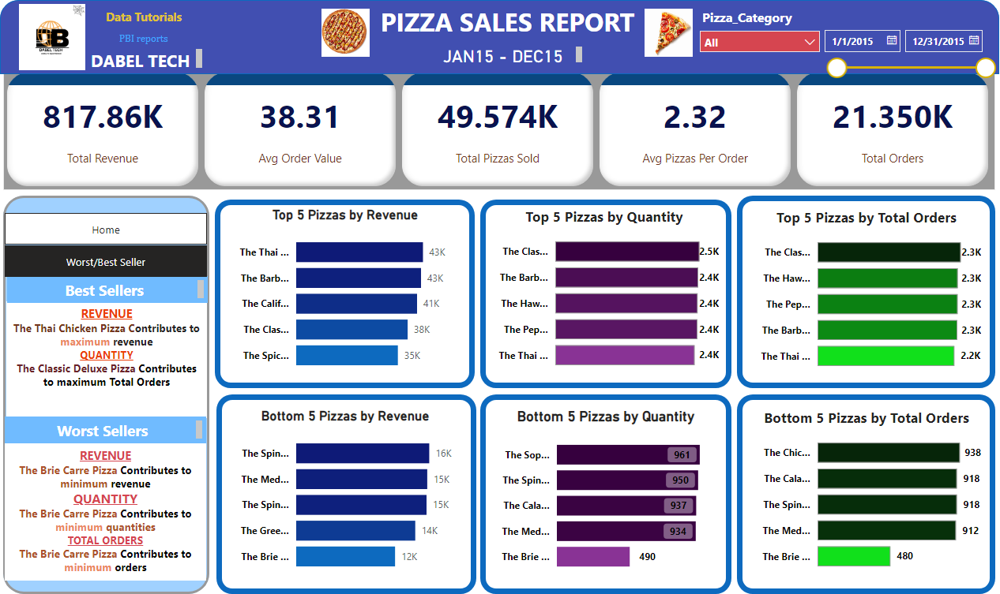

# 🍕 Pizza Sales Analysis — Power BI Dashboard

An end-to-end business intelligence project analyzing a full year (2015) of pizza
sales data. Raw transaction records are explored with SQL, modeled in Power BI, and
surfaced through an interactive dashboard built around five core KPIs and a set of
trend, category, and best/worst-seller visualizations.

### Sales Overview — KPIs, Trends & Category Mix


### Best & Worst Sellers


---

## 📌 Problem Statement

The business needed to analyze key indicators from its pizza sales data to gain
insight into performance, and to visualize ordering patterns across time and product
categories. The full brief is in [`Problem_Statement.pdf`](Problem_Statement.pdf).

### KPI Requirements

| KPI | Definition |
| --- | --- |
| **Total Revenue** | Sum of the total price of all pizza orders |
| **Average Order Value** | Total Revenue ÷ Total Orders |
| **Total Pizzas Sold** | Sum of the quantities of all pizzas sold |
| **Total Orders** | Total number of orders placed |
| **Average Pizzas Per Order** | Total Pizzas Sold ÷ Total Orders |

### Chart Requirements

1. **Daily Trend for Total Orders** — bar chart of total orders by day, to reveal
   weekly patterns and fluctuations in order volume.
2. **Monthly Trend for Total Orders** — line chart of total orders over time to
   identify peak periods and high-activity months.
3. **Percentage of Sales by Pizza Category** — chart showing each category's
   contribution to total sales.
4. Supporting breakdowns: % of sales by size, pizzas sold by category, and the top /
   bottom 5 pizzas by revenue, quantity, and order count.

---

## 📊 Results (2015)

| Metric | Value |
| --- | --- |
| Total Revenue | **$817.86K** |
| Average Order Value | **$38.31** |
| Total Pizzas Sold | **49,574** |
| Average Pizzas Per Order | **2.32** |
| Total Orders | **21,350** |

**Key takeaways**

- **Busiest days & time:** orders are highest on Thursdays and weekends, with
  Friday/Saturday evenings the peak windows.
- **Busiest months:** January, May, and July see the most orders.
- **Category performance:** the **Classic** category contributes the maximum sales
  and total orders (26.91% of sales); Classic, Supreme, Veggie, and Chicken are
  closely grouped overall.
- **Size performance:** **Large** pizzas drive the most sales (≈45%), followed by
  Medium and Regular.
- **Best sellers:** *The Thai Chicken Pizza* leads on revenue, while *The Classic
  Deluxe Pizza* leads on quantity and total orders.
- **Worst sellers:** *The Brie Carre Pizza* is lowest across revenue, quantity, and
  orders.

---

## 🗂️ Dataset

`pizza_sales.csv` — 48,620 order-line records spanning 01-Jan-2015 to 31-Dec-2015.

| Column | Description |
| --- | --- |
| `pizza_id` | Unique identifier for each pizza line item |
| `order_id` | Identifier grouping line items into an order |
| `pizza_name_id` | Short code for the pizza + size |
| `quantity` | Number of pizzas for the line item |
| `order_date` | Date the order was placed (DD-MM-YYYY) |
| `order_time` | Time the order was placed |
| `unit_price` | Price of a single pizza |
| `total_price` | `unit_price` × `quantity` |
| `pizza_size` | S, M, L, XL, XXL |
| `pizza_category` | Classic, Veggie, Supreme, Chicken |
| `pizza_ingredients` | Comma-separated ingredient list |
| `pizza_name` | Full display name of the pizza |

---

## 🛠️ Tools & Techniques

- **SQL** — KPI calculation and trend queries (`sql/pizza_sales_queries.sql`)
- **Power BI Desktop** — data modeling, DAX measures, interactive report with
  bookmarks/navigation between the overview and best/worst-seller pages
  (`PIZZA_PROJECT.pbix`)
- **DAX** — reusable measures for all KPIs and charts (`dax/measures.dax`)

---

## 📁 Repository Structure

```
pizza-sales-analysis/
├── PIZZA_PROJECT.pbix          # Power BI report file
├── pizza_sales.csv             # Source dataset
├── Problem_Statement.pdf       # Original project brief
├── sql/
│   └── pizza_sales_queries.sql # SQL for KPIs + chart data
├── dax/
│   └── measures.dax            # Power BI DAX measures
├── assets/
│   ├── dashboard_overview.png    # KPIs, daily/monthly trends, category & size mix
│   └── dashboard_best_worst.png  # Top & bottom 5 sellers
├── README.md
├── LICENSE
└── .gitignore
```

---

## 🚀 How to Use

1. Clone the repository.
2. Open `PIZZA_PROJECT.pbix` in **Power BI Desktop**.
3. If prompted, repoint the data source to your local copy of `pizza_sales.csv`.
4. To reproduce the analysis in SQL, load `pizza_sales.csv` into any SQL engine and
   run the queries in `sql/pizza_sales_queries.sql`.

---

## 📄 License

Released under the MIT License. See [LICENSE](LICENSE).
